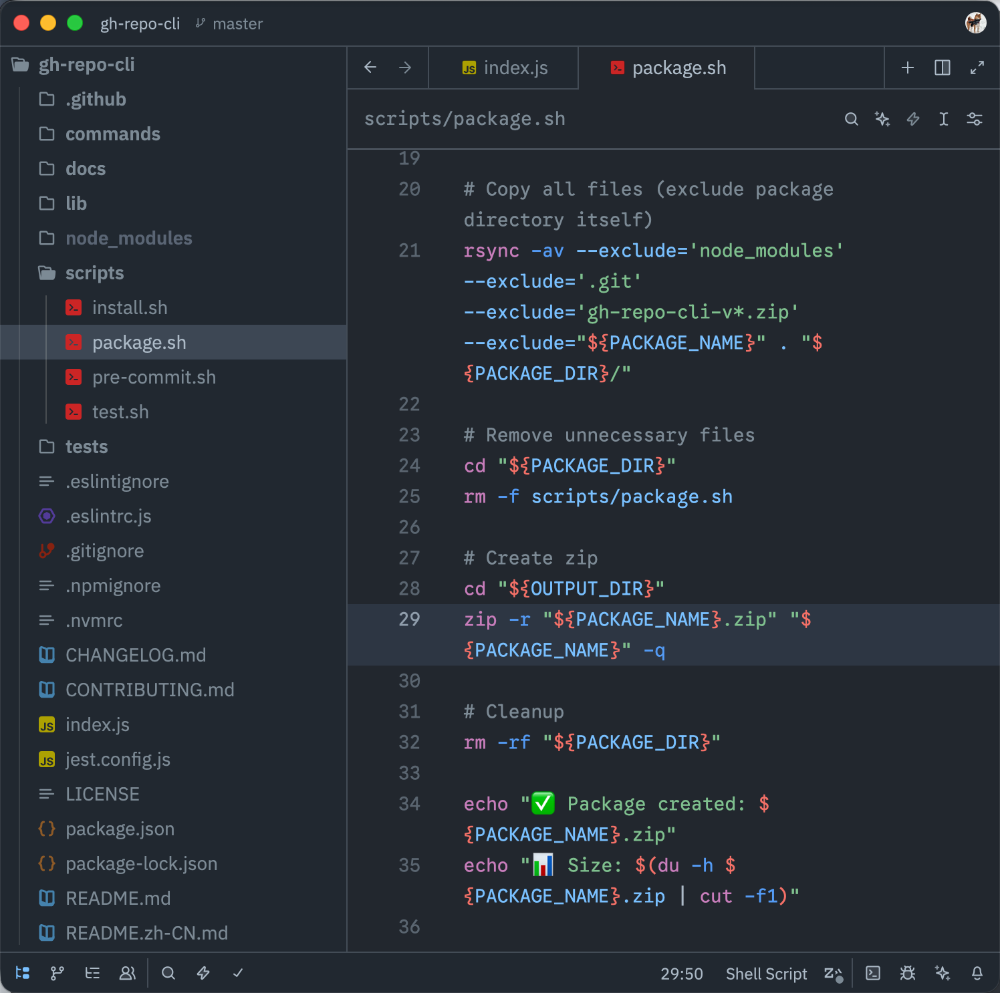

# GitHub Dark Dimmed for Zed

[](https://zed.dev/extensions/github-dark-dimmed)

GitHub Dark Dimmed theme for Zed.



## Install

**From Zed:** `Cmd+Shift+X` → search "GitHub Dark Dimmed" → Install

**Manual:**
```bash
cp themes/github-dark-dimmed.json ~/.config/zed/themes/
```

## Colors

| Layer | Color | Usage |
|-------|-------|-------|
| UI | `#212830` | Panels, status bar, inactive tabs |
| Editor | `#22272e` | Editor, terminal, active tab |
| Active line | `#262d35` | Current line highlight |

**Syntax:** Keywords `#f47067` · Strings `#96d0ff` · Functions `#dcbdfb` · Types `#6cb6ff` · Comments `#768390`

## Publish to Zed

This theme uses the manual submission process:

1. Fork [zed-industries/extensions](https://github.com/zed-industries/extensions)
2. Add entry to `extensions.toml`:
   ```toml
   [[extensions]]
   id = "github-dark-dimmed"
   name = "GitHub Dark Dimmed"
   version = "0.1.0"
   authors = ["nian1 <nian1.wiki@gmail.com>"]
   description = "GitHub Dark Dimmed theme for Zed"
   repository = "https://github.com/syxc/github-dark-dimmed-zed"
   ```
3. Submit PR

## License

MIT
